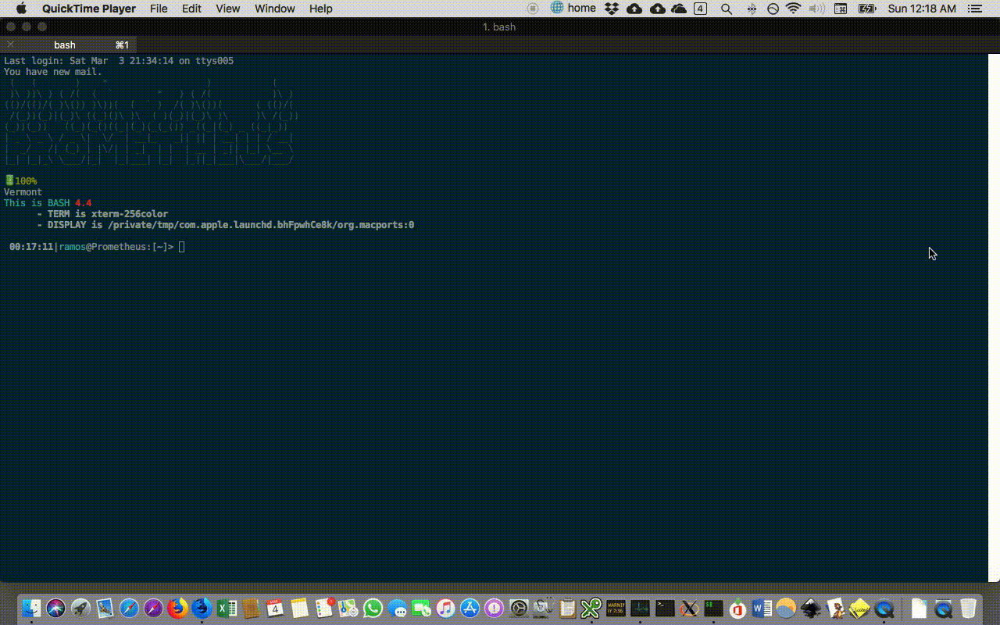

What is?
===
`sparseline` is a low resource alternative to the powerline options out there. What this means is that it only makes subtle augmentations to your prompt with a focus on git repos. Since `sparseline` does not invoke git, it's limited by the contents of the `.git` directory.




Features
===
* this is prefixed to PS1: `« remote/branch#truncated_hash »`
* The "truncated_hash" is replaced with local tag when applicable.
* Pure `bash`, does not invoke `git`.


Example
===
`« origin/master#77f6ff4 »` prepends.

How it looks on my machine:
` ● origin/master#345f2dbramos@saturn ~/Documents/Development/sparse-lie`


Usage
===
Simply source the file from the appropriate bash config file:
```bash
source /path/to/sparseline
```
Please note that `sparse-line` is meant to affect your PS1 only when within a git repository.


thoughts
===
* What about defining vars?


do
===
* switch for turning off color
* switch for no-special symbols

critique
===
* osse@freenode#git: I think it might be a bit naïve. For example the file refs/heads/somebranch doesn't necessarily exist even when the branch does
* lupine@freenode#git: some refs are stored in `.git/packed-refs` and so grepping `refs/*` is not enough; Not sure actually, it makes sense that local branches aren't packed that way
* _ikke_ git gc will pack local branches


more
===
Solidarity with <a href="https://996.icu" rel="nofollow"></a>
